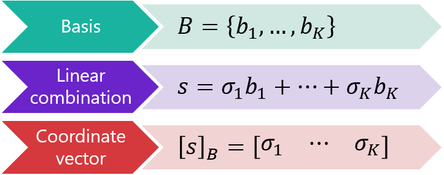
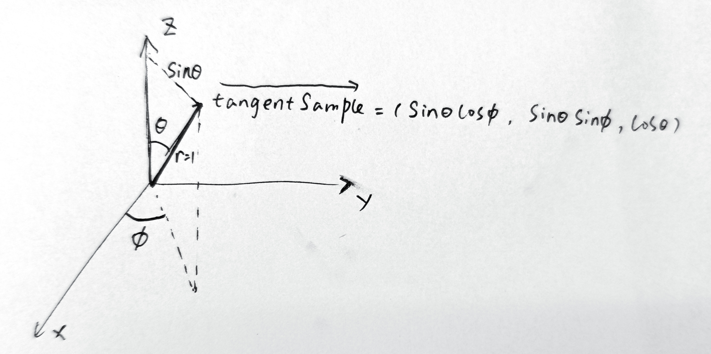

<h1 align='center' >1. Prerequisite</h1>

### 1.1 [Standard Reflection Equation](https://blog.csdn.net/yinhun2012/article/details/79466517)
$$float3\quad L = 2 * dot ( V , N ) * N - V$$


### 1.2 Change Of Basis
Suppose that a finite-dimensional vector space $S$ possesses a basis $B=\left\lbrace b_{1}, \ldots, b_{K}\right\rbrace$.

Then, any vector $sin S$ can be written as a linear combination of the basis: $s=\sigma_{1} b_{1}+\ldots+\sigma_{K} b_{K}$

<div align=center>

</div>

Suppose that we have a second basis $C=\left\lbrace c_{1}, \ldots, c_{K}\right\rbrace $

how do we transform a coordinate vector $[s]_{B}$ into a vector $[s]_{C}$ of coordinates with respect to the new basis?

### 1.3 Gamma Correct
Generally the art provides Albedo etc. maps in Gamma Color Space, i.e. the color values of Albedo etc. maps are carried out 1/2.2 times (approximated) with respect to Linear Color Space

Therefore, in the shader code, we need to convert the albedo texture to pad space prior to computation, which can be accomplished in the following way：
```
#define ALBEDO pow(texture(albedoMap, inUV).rgb, vec3(2.2))
```
and in the end of shader do gamma correction
```glsl
color = pow(color, vec3(1.0f / 2.2));
outColor = vec4(color, 1.0);
```

<h1 align='center' >2. Image Based Lighting</h1>

### 2.1 Reflectance Equation

$$L_o\left(p, \omega_o\right)=\int_{\Omega}\left(k_d \frac{c}{\pi}+k_s \frac{D F G}{4\left(\omega_o \cdot n\right)\left(\omega_i \cdot n\right)}\right) L_i\left(p, \omega_i\right) n \cdot \omega_i d \omega_i$$

the diffuse $k_d$ and specular $k_s$ term of the BRDF are independent from each other and we can split the integral in two:
$$L_o\left(p, \omega_o\right)=\int_{\Omega}\left(k_d \frac{c}{\pi}\right) L_i\left(p, \omega_i\right) n \cdot \omega_i d \omega_i+\int_{\Omega}\left(k_s \frac{D F G}{4\left(\omega_o \cdot n\right)\left(\omega_i \cdot n\right)}\right) L_i\left(p, \omega_i\right) n \cdot \omega_i d \omega_i$$

### 2.2 Diffuse Integral Part(Irradiance Map)
the color $c$ ,the refraction ratio $k_d$ and $π$ are constant over the integral, we can move the constant term out of the diffuse integral:
$$L_{o\_diffuse}\left(p, \omega_o\right)=k_d \frac{c}{\pi} \int_{\Omega} L_i\left(p, \omega_i\right) n \cdot \omega_i d \omega_i$$

with this knowledge, we can calculate or pre-compute a cubemap that stores in each sample direction. This pre-computed cubemap can be thought of as the pre-computed sum of all indirect diffuse light of the scene hitting some surface aligned along direction $\omega_o$ and is known as an irradiance map.


we can respecte above diffuse integral equation as spherical coordinate:
$$L_{o}\left(p, \phi_{o}, \theta_{o}\right)=k_{d} \frac{c}{\pi} \int_{\phi=0}^{2 \pi} \int_{\theta=0}^{\frac{1}{2} \pi} L_{i}\left(p, \phi_{i}, \theta_{i}\right) \cos (\theta) \sin (\theta) d \phi d \theta$$

based on the [Riemann sum](https://en.wikipedia.org/wiki/Riemann_sum), we can solve the integral by discrete sum:

$$
\begin{aligned}
L_{o}\left(p, \phi_{o}, \theta_{o}\right) &  =k_{d} \frac{c }{\pi}  \sum_{\phi=0}^{n 1} \sum_{\theta=0}^{n 2} L_{i}\left(p, \phi_{i}, \theta_{i}\right) \cos (\theta) \sin (\theta) \frac{2\pi}{n 1} \frac{ \frac{1 }{2} \pi}{n 2} \\ 
& =k_{d} \frac{c \pi}{n 1 n 2} \sum_{\phi=0}^{n 1} \sum_{\theta=0}^{n 2} L_{i}\left(p, \phi_{i}, \theta_{i}\right) \cos (\theta) \sin (\theta)
\end{aligned}
$$

```glsl
//example code of Irradiance Map 
vec3 irradiance = vec3(0.0);  
vec3 up    = vec3(0.0, 1.0, 0.0);
vec3 right = normalize(cross(up, normal));
        up = normalize(cross(normal, right));

float sampleDelta = 0.025;
float nrSamples = 0.0; 
for(float phi = 0.0; phi < 2.0 * PI; phi += sampleDelta)
{
    for(float theta = 0.0; theta < 0.5 * PI; theta += sampleDelta)
    {
        // spherical to cartesian (in tangent space)
        // vec3 tangentSample表示切空间上某一方向
        vec3 tangentSample = vec3(sin(theta) * cos(phi),  sin(theta) * sin(phi), cos(theta));
        // tangent space to world
        vec3 sampleVec = tangentSample.x * right + tangentSample.y * up + tangentSample.z * N; 

        irradiance += texture(environmentMap, sampleVec).rgb * cos(theta) * sin(theta);
        nrSamples++;
    }
}
irradiance = PI * irradiance * (1.0 / float(nrSamples));
```
<div align=center>

</div>
<!--   -->

<div align=center>

</div>


### 2.3 Specular Integral Part
$$L_{o}\left(p, \omega_{o}\right)=\int_{\Omega} L_{i}\left(p, \omega_{i}\right) d \omega_{i} * \int_{\Omega} f_{r}\left(p, \omega_{i}, \omega_{o}\right) n \cdot \omega_{i} d \omega_{i}$$


#### 2.3.1 Pre-Filter Environment Map
 given any direction vector $\omega_i$, we can get the scene's radiance by environment cubemap:

 ```glsl
 vec3 radiance = texture(cubemapEnvironment, w_i).rgb;  
 ```

solving the integral requires us to sample the environment map from not just one direction, but all possible directions $\omega_i$ over the hemisphere $Ω$

 #### 2.3.2 Environment BRDF

In note [Monte Carlo Integral](./Monte_Carlo_Integral.md), we get Importance Sampling in Specular Part of Reflectance Equation as:

$$
\begin{aligned}
L_o\left(p, \omega_o\right) & \approx 
\frac{1}{N} \sum_{k=1}^{N} \frac{\left(\frac{D F G}{4\left(\omega_{o} \cdot n\right)\left(\omega_{i_k} \cdot n\right)}\right) L_{i}\left(p, \omega_{i_k}\right) n \cdot \omega_{i_k}}{PDF(\omega_{i_k})} \\
& = \frac{1}{N} \sum_{k=1}^{N} \frac{\left(\frac{D F G}{4\left(\omega_{o} \cdot n\right)\left(\omega_{i_k} \cdot n\right)}\right) L_{i}\left(p, \omega_{i_k}\right) n \cdot \omega_{i_k}}{  \frac{D(h) (n \cdot h)}{4(\omega_{o} \cdot h)} } \\
& = \frac{1}{N} \sum_{k=1}^{N} \frac{F G L_{i}\left(p, \omega_{i_k}\right) (\omega_{o} \cdot h) }{\left(n \cdot h\right) \left(\omega_{o} \cdot n\right)}
\end{aligned}
$$


With the Fresnel-Schlick approximation gives us $F = F_{0}+\left(1-F_{0}\right)\left(1-\omega_{o} \cdot h\right)^{5}$ and a constant radiance $L_i$ of 1.0, we can get:

$$
\begin{aligned}
L_o\left(p, \omega_o\right) & \approx 
\frac{1}{N} \sum_{k=1}^{N} \frac{F G L_{i}\left(p, \omega_{i_k}\right) (\omega_{o} \cdot h) }{\left(n \cdot h\right) \left(\omega_{o} \cdot n\right)} \\
& = \frac{1}{N} \sum_{k=1}^{N} \frac{G  (\omega_{o} \cdot h) }{\left(n \cdot h\right) \left(\omega_{o} \cdot n\right)} (F_{0}+\left(1-F_{0}\right)\left(1-\omega_{o} \cdot h\right)^{5}) \\
& = \frac{1}{N} \sum_{k=1}^{N} \frac{G  (\omega_{o} \cdot h) }{\left(n \cdot h\right) \left(\omega_{o} \cdot n\right)} (F_0 (1-(1-\omega_o\cdot h)^5)+(1-\omega_o \cdot h)^5) \\

& = F_0 { \color{Red}   \frac{1}{N} \sum_{k=1}^{N} \frac{G  (\omega_{o} \cdot h) }{\left(n \cdot h\right) \left(\omega_{o} \cdot n\right)} (1-(1-\omega_o\cdot h)^5) }  + { \color{Green}   \frac{1}{N} \sum_{k=1}^{N} \frac{G  (\omega_{o} \cdot h) }{\left(n \cdot h\right) \left(\omega_{o} \cdot n\right)} (1-\omega_o\cdot h)^5 }\\
\end{aligned}
$$

In the end, We take both the angle NdotV and the roughness as input, generate a pre-compute vector(the red and green part) 


  ```glsl
  //example code of BRDF_LUT
vec2 IntegrateBRDF(float NdotV, float roughness)
{
    //假设V的长度是1，并且在xz平面上
    vec3 V;
    V.x = sqrt(1.0 - NdotV*NdotV);
    V.y = 0.0;
    V.z = NdotV;

    float A = 0.0;
    float B = 0.0;

    vec3 N = vec3(0.0, 0.0, 1.0);

    const uint SAMPLE_COUNT = 1024u;
    for(uint i = 0u; i < SAMPLE_COUNT; ++i)
    {
        vec2 Xi = Hammersley(i, SAMPLE_COUNT);
        vec3 H  = ImportanceSampleGGX(Xi, N, roughness);
        vec3 L  = normalize(2.0 * dot(V, H) * H - V);

        float NdotL = max(L.z, 0.0);
        float NdotH = max(H.z, 0.0);
        float VdotH = max(dot(V, H), 0.0);

        if(NdotL > 0.0)
        {
            float G = GeometrySmith(N, V, L, roughness);
            float G_Vis = (G * VdotH) / (NdotH * NdotV);
            float Fc = pow(1.0 - VdotH, 5.0);

            A += (1.0 - Fc) * G_Vis;
            B += Fc * G_Vis;
        }
    }
    A /= float(SAMPLE_COUNT);
    B /= float(SAMPLE_COUNT);
    return vec2(A, B);
}
// ----------------------------------------------------------------------------
void main() 
{
    vec2 integratedBRDF = IntegrateBRDF(TexCoords.x, TexCoords.y);
    FragColor = integratedBRDF;
}
 ```
