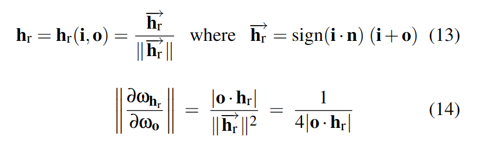
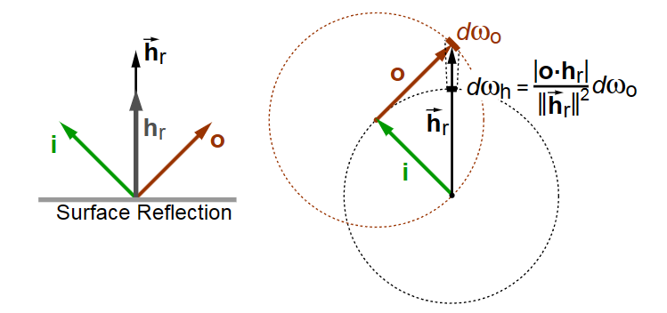

Change of variables in the probability density
$$
\left|p_{Y}(y) d y\right|=\left|p_{X}(x) d x\right|
$$

## 1 Monte Carlo Integral
Monte Carlo integration is a technique for numerical integration using random numbers.

Basically it takes N independent samples randomly across the whole domain and use these samples to evaluate the integral.
$$I=\int_{\Omega} f(x) \mathrm{d} x \approx  \frac{1}{N} \sum_{i=1}^{N} \frac{f\left(x_{i}\right)}{p\left(x_{i}\right)}$$
Here, N independent samples $x_{0}, x_{1}, \ldots x_{n}$  are generated according to some property density function $p(x)$

The estimator is unbiased. In other words, the average of the estimator is exactly the integral we target on.

$$
\begin{aligned}
E\left[F_{N}\right] & =E\left[\frac{1}{N} \sum_{i=1}^{N} \frac{f\left(x_{i}\right)}{p\left(x_{i}\right)}\right] \\
& =\frac{1}{N} \sum_{i=1}^{N} \int_{\Omega} \frac{f\left(x_{i}\right)}{p\left(x_{i}\right)} p\left(x_{i}\right) d(x) \\
& =\int_{\Omega} f(x) \mathrm{d} x \\
& =I
\end{aligned}
$$

Just having the average value equaling to the integral doesn’t solve the problem, it is necessary to make sure that it converge to the right one as the number of samples grows. The variance approaches to zero if N keeps growing.

$$
\begin{aligned}
V\left[F_{N}\right] & =V\left[\frac{1}{N} \sum_{i=1}^{N} \frac{f\left(x_{i}\right)}{p\left(x_{i}\right)}\right] \\
& =\frac{1}{N^{2}} \sum_{i=1}^{N} V\left[\frac{f\left(x_{i}\right)}{p\left(x_{i}\right)}\right] \\
& =\frac{1}{N} V\left[\frac{f(x)}{p(x)}\right] \\
& =\frac{1}{N}\left(\int_{\Omega} \frac{f^{2}(x)}{p(i)} d(x)-I\right)
\end{aligned}
$$


## 2. Importance Sampling
### 2.1 General Idea of Importance Sampling
The first thing to do with Monte Carlo Integral method is to pick a pdf first.

As the number of samples increases, it will converge to the correct value, but in some cases the speed of convergence is very poor.

The reason about this, consider a roughness close to zero, which corresponds to a perfect reflector. In this case, the only light direction that matters is the direction of perfect reflection and every other direction will contribute nothing to our sum. 

**The general idea of importance sampling:**  evaluate the samples where they contribute more to the final result. 


### 2.2 Importance Sampling in Specular Part of Reflectance Equation

In order to integrate the specular part of our radiance equation, we’ll need to use importance sampling, using the following equation:

$$
L_o\left(p, \omega_o\right) =
k_s \int_{\Omega}\left(\frac{D F G}{4\left(\omega_o \cdot n\right)\left(\omega_i \cdot n\right)}\right) L_i\left(p, \omega_i\right) n \cdot \omega_i d \omega_i \approx 
\frac{1}{N} \sum_{k=1}^{N} \frac{\left(\frac{D F G}{4\left(\omega_{o} \cdot n\right)\left(\omega_{i_k} \cdot n\right)}\right) L_{i}\left(p, \omega_{i_k}\right) n \cdot \omega_{i_k}}{PDF(\omega_{i_k})}
$$

We’ll choose a PDF that resembles our BRDF in order to decrease the variance. We can use our Normal Distribution Function $D$ as our PDF, the reasoning being that the NDF determines which directions contribute the most to the light leaving our larger surface. 

As NDF can be normalized by:
$$\int_{\Omega} D(h)(n \cdot h) d \omega_{h}=1$$

Thus, we can use the following equation as PDF:
$$
p_h(h)=D(h)(n \cdot h)=\frac{\alpha^2(n \cdot h)}{\pi\left(\left(\alpha^2-1\right) (n \cdot h) ^2 +1\right)^2}
$$

If we want our PDF to be used for $\omega_{i}$ instead of the half vector ℎ h then we’ll need to include the Jacobian of the transformation from half vector to $\omega_{i}$, this can be represented as [the following equation](http://www.cs.cornell.edu/~srm/publications/EGSR07-btdf.pdf):
$$
\begin{aligned}
J(\mathbf{h}) & =\frac{1}{4(\omega_{o} \cdot h)} \\
\operatorname{PDF}\left(\omega_{o}, \omega_{i_k}\right) & =\frac{D(h) (n \cdot h)}{4(\omega_{o} \cdot h)}
\end{aligned}
$$
<div align=center>


</div>

We can now write the importance sampling equation as follows:

$$
\begin{aligned}
L_o\left(p, \omega_o\right) & \approx 
\frac{1}{N} \sum_{k=1}^{N} \frac{\left(\frac{D F G}{4\left(\omega_{o} \cdot n\right)\left(\omega_{i_k} \cdot n\right)}\right) L_{i}\left(p, \omega_{i_k}\right) n \cdot \omega_{i_k}}{PDF(\omega_{i_k})} \\
& = \frac{1}{N} \sum_{k=1}^{N} \frac{\left(\frac{D F G}{4\left(\omega_{o} \cdot n\right)\left(\omega_{i_k} \cdot n\right)}\right) L_{i}\left(p, \omega_{i_k}\right) n \cdot \omega_{i_k}}{  \frac{D(h) (n \cdot h)}{4(\omega_{o} \cdot h)} } \\
& = \frac{1}{N} \sum_{k=1}^{N} \frac{F G L_{i}\left(p, \omega_{i_k}\right) (\omega_{o} \cdot h) }{\left(n \cdot h\right) \left(\omega_{o} \cdot n\right)}
\end{aligned}
$$


## 3. Multiple Importance Sampling


### 1.3 The Inverse Transform Method
Inverse transform sampling is a method for generating random numbers from any probability distribution by using its inverse cumulative distribution function.

#### 1.3.1 Continuous Distributions Sampling
The cumulative distribution function(CDF) for a random variable $X$ represents:
$$
F_X(x)=P(X \leq x)
$$

We can sample variable $X$ by two step:
* Generate $U∼uniform(0,1)$
* Let $X=F^{−1}X(U)$

### 1.3.2 Discrete Distributions Sampling
[read hear](https://stephens999.github.io/fiveMinuteStats/inverse_transform_sampling.html)


## 2.1 Sampling GGX
Basic form of GGX represents:
$$
D(h)=\frac{\alpha^2}{\pi\left(\left(\alpha^2-1\right) \cos ^2 \theta+1\right)^2}
$$
Here, $\cos\theta = dot(N, H)$ and $H = normalize (V + L) $.


The PDF respecting solid angle represents(As suggested in the Disney
course notes):
$$
p_h(h)=\frac{\alpha^2\cos\theta}{\pi\left(\left(\alpha^2-1\right) \cos ^2 \theta+1\right)^2}
$$

We can respecting above equation as spherical coordinate:
$$
p_h(\theta, \phi)=\frac{\alpha^2 \cos \theta \sin \theta}{\pi\left(\left(\alpha^2-1\right) \cos ^2 \theta+1\right)^2}
$$

And we can calculate marginal density function $p_h(\theta)$ by integral on $\phi$:
$$
p_h(\theta)=\int_0^{2 \pi} p_h(\theta, \phi) d \phi=\frac{2 \alpha^2 \cos \theta \sin \theta}{\left(\left(\alpha^2-1\right) \cos ^2 \theta+1\right)^2}
$$

Then conditional density for $\phi$ writes:
$$\mathrm{p_h}(\phi \mid \theta)=\frac{\mathrm{p_h}(\theta, \phi)}{\mathrm{p}_\theta(\theta)}=\frac{1}{2 \pi}$$

And the CDF of $\phi$ writes:
$$\mathrm{P_h}(\phi \mid \theta)=\int_0^\phi \frac{1}{2 \pi} d \phi^{\prime}=\frac{1}{2 \pi} \phi$$


Let’s calculate the CDF of $\theta$ next:

$$
\begin{aligned}
F_h(\theta) & =\int_0^\theta \frac{2 \alpha^2 \cos (t) \sin (t)}{\left(\cos ^2 t\left(\alpha^2-1\right)+1\right)^2} d t \\
& =\int_\theta^0 \frac{\alpha^2}{\left(\cos ^2 t\left(\alpha^2-1\right)+1\right)^2} d\left(\cos ^2 t\right) \\
& =\frac{\alpha^2}{\alpha^2-1} \int_0^\theta d \frac{1}{\cos ^2 t\left(\alpha^2-1\right)+1} \\
& =\frac{\alpha^2}{\alpha^2-1}\left(\frac{1}{\cos ^2 \theta\left(\alpha^2-1\right)+1}-\frac{1}{\alpha^2}\right) \\
& =\frac{\alpha^2}{\cos ^2 \theta\left(\alpha^2-1\right)^2+\left(\alpha^2-1\right)}-\frac{1}{\alpha^2-1} \\
& = v
\end{aligned}
$$

The inversion for $\phi$:
$$u=\mathrm{P}(\phi \mid \theta)=\frac{1}{2 \pi} \phi \quad \Rightarrow \quad \phi=2 \pi u$$

The inversion for $\theta$:

$$
\theta=\arccos \sqrt{\frac{1-v}{v\left(\alpha^2-1\right)+1}} \operatorname{or} \theta=\arctan \left(\alpha \sqrt{\frac{v}{1-v}}\right)
$$


```glsl
//example code of Sampling GGX
//float2 Xi is a uniformly distributed random value
float3 ImportanceSampleGGX( float2 Xi, float Roughness, float3 N )
{


    // Calculate phi and cosine of theta
    float a = Roughness * Roughness;
    float Phi = 2 * PI * Xi.x;
    float CosTheta = sqrt( (1 - Xi.y) / ( 1 + (a*a - 1) * Xi.y ) );
    float SinTheta = sqrt( 1 - CosTheta * CosTheta );

    // Build a half vector
    float3 H;
    H.x = SinTheta * cos( Phi );
    H.y = SinTheta * sin( Phi );
    H.z = CosTheta;

    // Transform the vector from tangent space to world space
    float3 UpVector = abs(N.z) < 0.999 ? float3(0,0,1) : float3(1,0,0);
    float3 right = normalize( cross( UpVector, N ) );
    float3 forward = cross( N, right );

    return right * H.x + forward * H.y + N * H.z;
}
```

## 2.2 Sampling Beckmann
[read hear](https://stephens999.github.io/fiveMinuteStats/inverse_transform_sampling.html)

## 2.3 Sampling Blinn
[read hear](https://stephens999.github.io/fiveMinuteStats/inverse_transform_sampling.html)