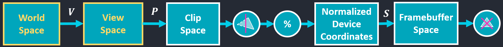
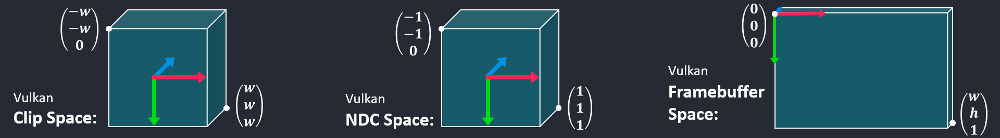
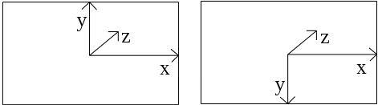

<h1 align='center' >1. Prerequisite</h1>

### 1.1 [Homogeneous Coordinates and Transform Matrix](https://www.scratchapixel.com/lessons/3d-basic-rendering/perspective-and-orthographic-projection-matrix/projection-matrices-what-you-need-to-know-first.html)
**Homogeneous Coordinates: **To multiply a 3D point by a 4x4 matrix, we need to convert the point's Cartesian coordinates to homogeneous coordinates.

The fourth coordinate of a point in its homogeneous representation is denoted by the letter $w$. When we convert a point from Cartesian to homogeneous coordinates, $w$ is set equal to 1.

**Affine Transform Matrix:** A 3D cartesian point P converted to a point with homogeneous coordinates ${x, y, z, w = 1}$, and multiplied by a 4x4 affine transformation matrix, always gives a point P' with homogeneous coordinates and whose $w$ is always equal to 1.

**Projection Matrix** ：do not keep the transformed points w-coordinate equal to 1, a point transformed by a projection matrix will thus require the $x'$ $y'$ and $z'$ coordinates to be normalized.

$$
Perspective\,\,Projection = \left[\begin{array}{cccc}
\frac{1}{\left(\tan \left(\text { fov }_{y} / 2\right) * \text { aspect }\right)} & 0 & 0 & 0 \\
0 & \frac{1}{\tan \left(\text { fov }_{y} / 2\right)} & 0 & 0 \\
0 & 0 & -\frac{f+n}{f-n} & -\frac{2 f n}{f-n} \\
0 & 0 & -1 & 0
\end{array}\right]
$$

$$
Orthographic\,\,Projection = \left[\begin{array}{cccc}
\frac{2}{\text { right-left }} & 0 & 0 & -\frac{\text { right+left }}{\text { right-left }} \\
0 & \frac{2}{\text { top-bottom }} & 0 & -\frac{\text { top+bottom }}{\text { top-bottom }} \\
0 & 0 & \frac{-2}{\text { far-near }} & -\frac{\text { far+near }}{\text { far-near }} \\
0 & 0 & 0 & 1
\end{array}\right]
$$

<h1 align='center' >2. Vulkan Coordinate System</h1>

<div align=center>

</div>

VertexShader -> PrimitiveClipping -> Homogeneous Division and Backface Culling -> FragmentDraw

<div align=center>

</div>

### 2.1 [Clip Space](https://johannesugb.github.io/gpu-programming/setting-up-a-proper-vulkan-projection-matrix/)
Clip space is modeled as a prism, which is called the clip volume, If there are vertices of a primitive that are outside of this space, they will be rejected (clipped) by our GPU. In vulkan, the view volume is defined by:
$$
\begin{array}{c}
-w_{clip} \leq x_{clip} \leq w_{clip} \\
-w_{clip} \leq y_{clip} \leq w_{clip} \\
z_{m} \leq z_{clip} \leq w_{clip}
\end{array}
$$
where if VkPipelineViewportDepthClipControlCreateInfoEXT::negativeOneToOne is VK_TRUE $z_m$ is equal to $-w_{clip}$ otherwise $z_m$ is equal to 0.

The standard perspective projection matrix transforms points on the near plane to have a $z_{clip}$ value of $-w_{clip}$ and points on the far plane to have a $z_{clip}$ of $w_{clip}$.

In Vulkan, the viewport transform for the $z$ component is given by this equation instead: (maxDepth-minDepth) * $z_d$ + minDepth. maxDepth is typically 1.0 and minDepth 0.0. If $z_d$ is mapped in [0, 1] then depth will be in [0, 1] as well.

#### Method 1
Many Vulkan demos do set the minDepth and maxDepth to 0 and 1 respectively and use another line of code at the end of the vertex shader, This code will map $z_d$ in [0, 1]:
```glsl
gl_Position.z = (gl_Position.z + gl_Position.w) / 2.0;
```
#### Method 2
In addition, one can pre-multiply projection matrix by the following correction matrix

$$
\left[\begin{array}{cccc}
1 & 0 & 0 & 0 \\
0 & -1 & 0 & 0 \\
0 & 0 & 1 / 2 & 1 / 2 \\
0 & 0 & 0 & 1
\end{array}\right]
$$

#### Method 3
If you are using Glm you may be interested in the new define **GLM_FORCE_DEPTH_ZERO_TO_ONE**. This define will give you the correct depth range but still leave the y direction reversed.

### 2.2 NDC Space [1](https://anki3d.org/vulkan-coordinate-system/) [2](http://matthewwellings.com/blog/the-new-vulkan-coordinate-system/)
In OpenGL we had a left-hand NDC space (left pic), in Vulkan we have a right hand NDC space (right pic).
<div align=center>

</div>

Typically (after performing the mapping in 2.1), the NDC coordinates for vulkan are in the following range:
$$
\begin{array}{c}
-1 \leq x_{d} \leq 1 \\
-1 \leq y_{d} \leq 1 \\
0  \leq z_{d} \leq 1
\end{array}
$$

where $z_d$ is $z_{clip}/w_{clip}$ (the same for $x_d$ and $y_d$)


### 2.2 Framebuffer Space
The vertex’s framebuffer coordinates ($x_f$ , $y_f$ , $z_f$) are given by:
$$
\left(\begin{array}{c}
x_{f} \\
y_{f} \\
z_{f}
\end{array}\right)=\left(\begin{array}{c}
\frac{p_{x}}{2} x_{d}+o_{x} \\
\frac{p_{y}}{2} y_{d}+o_{y} \\
p_{z} \times z_{d}+o_{z}
\end{array}\right)
$$
where (p_x, p_y, p_z) and $(o_x, o_y, o_z)$ are determined by the struct VkViewport.

$$o_x = x + width / 2$$
$$o_y = y + height / 2$$
$$o_z = !negativeOneToOne \,?\, minDepth : (maxDepth + minDepth) / 2$$
$$p_x = width$$
$$p_y = height$$
$$p_z = !negativeOneToOne \,?\, maxDepth - minDepth : (maxDepth - minDepth)/2$$

If $x = y = 0$, the origin is at the top left of the screen.

```c
typedef struct VkViewport {
    float    x;
    float    y;
    float    width;
    float    height;
    float    minDepth;
    float    maxDepth;
} VkViewport;
```