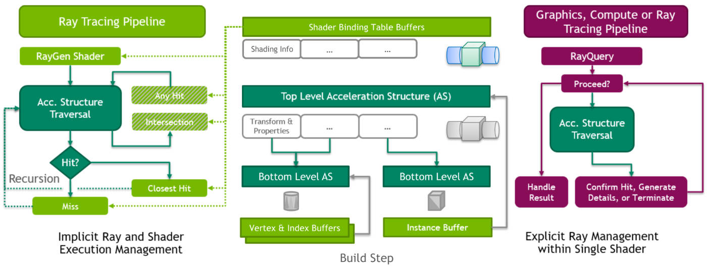

<h1 align='center' >1. Prerequisite</h1>

### 1.1 Plane Intersection
- Implicit formula for a plane:
$$
A x+B y+C z+D=0
$$
- given the plane normal vector $n=(A,B,C)$, and any point on the plane $v=(x,y,z)$, we can use the dot product to solve for $D$
$$
\mathbf{n} \cdot \mathbf{v}=D
$$
- The intersection with ray $R(t)=\mathbf{P}+t \mathbf{d}$
$$
\mathbf{n} \cdot(\mathbf{P}+t \mathbf{d})=D
$$
$$
t=\frac{D-\mathbf{n} \cdot \mathbf{P}}{\mathbf{n} \cdot \mathbf{d}}
$$
- Coordinate frame: intersection point $\mathbf{P}$
$$
\mathbf{P}=\mathbf{Q}+\alpha \mathbf{u}+\beta \mathbf{v}
$$
If $u$ and $v$ were guaranteed to be orthogonal to each other, it would be a simple matter of using the dot product to project P onto each of the basis vectors u and v.
$$
\begin{array}{c}
\mathbf{w}=\frac{\mathbf{n}}{\mathbf{n} \cdot(\mathbf{u} \times \mathbf{v})}=\frac{\mathbf{n}}{\mathbf{n} \cdot \mathbf{n}} \\
\alpha=\mathbf{w} \cdot(\mathbf{p} \times \mathbf{v}) \\
\beta=\mathbf{w} \cdot(\mathbf{u} \times \mathbf{p})
\end{array}
$$

<h1 align='center' >2. Vulkan Raytracing</h1>

### 2.1 [Extension](https://www.khronos.org/blog/vulkan-ray-tracing-final-specification-release)
- The most obvious change is that the provisional VK_KHR_ray_tracing extension has been split into 3 extensions::
    - **VK_KHR_acceleration_structure** - for acceleration structure building and management
    - **VK_KHR_ray_tracing_pipeline** - for ray tracing shader stages and pipelines, and
    - **VK_KHR_ray_query** - providing ray query intrinsics for all shader stages.
- Both of these extensions depend on the VK_KHR_acceleration_structure extension to provide a common base for acceleration structure management. 
- Vulkan 1.1 and SPIR-V 1.4 are now required.

### 2.2 [Acceleration Structure](https://nvpro-samples.github.io/vk_raytracing_tutorial_KHR/)
- ray tracing requires organizing the geometry into an acceleration structure (AS) that will reduce the number of ray-triangle intersection tests during rendering.
- This is typically implemented in hardware as a hierarchical structure, but only two levels are exposed to the user: a single **top-level acceleration structure (TLAS)** referencing any number of **bottom-level acceleration structures (BLAS)**
- Typically, a **BLAS** corresponds to individual 3D models within a scene, and a **TLAS** corresponds to an entire scene built by positioning (with 3-by-4 transformation matrices) individual referenced BLASes.
- **BLAS** store the actual vertex data. The **TLAS** will contain the object instances, each with its own transformation matrix and reference to a corresponding BLAS. 
- The bottom-level acceleration structure is only used by reference from the top-level acceleration structure.
- The top-level acceleration structure is accessed from the shader as a descriptor binding or by device address (obtained via vkGetAccelerationStructureDeviceAddressKHR).
- we made changes to use device addresses consistently throughout all the extensions. 

<div align=center>

</div>

<div align=center>

</div>


#### 2.1.1 [Create an acceleration structure](https://www.khronos.org/blog/ray-tracing-in-vulkan)
- First determine the sizes required for the acceleration structure. The size of the acceleration structure and the scratch buffer sizes for builds and updates are obtained in the **VkAccelerationStructureBuildSizesInfoKHR** structure via the **vkGetAccelerationStructureBuildSizesKHR** command. 
- The shape and type of the acceleration structure to be created is described in **VkAccelerationStructureBuildGeometryInfoKHR** structure. This is the same structure that will later be used for the actual build, but the acceleration structure parameters and geometry data pointers do not need to be fully populated at this point (although they can be), just the acceleration structure type, and the geometry types, counts, and maximum sizes.
- Once the required sizes have been determined, the application creates a **VkBuffer** for the acceleration structure (accelerationStructureSize), and **VkBuffer**(s) as needed for the build (buildScratchSize) and update (updateScratchSize) scratch buffers. (scratch buffers used to create acceleration structure, after create it can be deleted)
- the **VkAccelerationStructureKHR** object can be created using the **vkCreateAccelerationStructureKHR** command which creates an acceleration structure of the specified type and size and places it at offset within the buffer provided in **VkAccelerationStructureCreateInfoKHR**. (Unlike most other resources in Vulkan, the specified portion of the buffer fully provides the memory for the acceleration structure; no additional memory requirements need to be queried or memory bound to the acceleration structure object. If desired, multiple acceleration structures can be placed in the same VkBuffer, provided the acceleration structures do not overlap.)
- Builds are performed with **vk{Cmd}BuildAccelerationStructuresKHR**. For a bottom-level acceleration structure, the vertex data for triangles or the extent information for the AABBs is pulled from a buffer. A top-level acceleration structure pulls the shading, transform, and reference information for each instance from a structure in a buffer. An update to an acceleration structure is performed using the same functions with a special flag to indicate that an update of the positions from the existing acceleration structure is required.
- **VK_ACCELERATION_STRUCTURE_TYPE_GENERIC_KHR** can be used at acceleration structure creation time in cases where the actual acceleration structure type (top or bottom) is not yet known, [ref](https://www.khronos.org/blog/vulkan-ray-tracing-final-specification-release). 
The actual acceleration structure type must be specified as VK_ACCELERATION_STRUCTURE_TYPE_TOP_LEVEL_KHR or VK_ACCELERATION_STRUCTURE_TYPE_BOTTOM_LEVEL_KHR when the build is performed and cannot be changed. 

```c
typedef struct VkAccelerationStructureGeometryKHR {
    VkStructureType                           sType;
    const void*                               pNext;
    VkGeometryTypeKHR                         geometryType;
    VkAccelerationStructureGeometryDataKHR    geometry;
    VkGeometryFlagsKHR                        flags;
} VkAccelerationStructureGeometryKHR;

//used to describe shape and type of the acceleration structure, This is the same structure that will later be used for the actual build
typedef struct VkAccelerationStructureBuildGeometryInfoKHR {
    VkStructureType                                     sType;
    const void*                                         pNext;
    VkAccelerationStructureTypeKHR                      type;
    VkBuildAccelerationStructureFlagsKHR                flags;
    VkBuildAccelerationStructureModeKHR                 mode;
    VkAccelerationStructureKHR                          srcAccelerationStructure;
    VkAccelerationStructureKHR                          dstAccelerationStructure;
    uint32_t                                            geometryCount;
    const VkAccelerationStructureGeometryKHR*           pGeometries;
    const VkAccelerationStructureGeometryKHR* const*    ppGeometries;
    VkDeviceOrHostAddressKHR                            scratchData;
} VkAccelerationStructureBuildGeometryInfoKHR;

//used to obtained size
typedef struct VkAccelerationStructureBuildSizesInfoKHR {
    VkStructureType    sType;
    const void*        pNext;
    VkDeviceSize       accelerationStructureSize;
    VkDeviceSize       updateScratchSize;
    VkDeviceSize       buildScratchSize;
} VkAccelerationStructureBuildSizesInfoKHR;

//used to  create VkAccelerationStructureKHR object
typedef struct VkAccelerationStructureCreateInfoKHR {
    VkStructureType                          sType;
    const void*                              pNext;
    VkAccelerationStructureCreateFlagsKHR    createFlags;
    VkBuffer                                 buffer;
    VkDeviceSize                             offset;
    VkDeviceSize                             size;
    VkAccelerationStructureTypeKHR           type;
    VkDeviceAddress                          deviceAddress;
} VkAccelerationStructureCreateInfoKHR;
```

#### 2.1.2 Step to Build Bottom-Level Acceleration Structure
精简版：
1：对每个model拿到VkAccelerationStructureGeometryTrianglesDataKHR，VkAccelerationStructureGeometryKHR，VkAccelerationStructureBuildRangeInfoKHR三件套
2：用VkAccelerationStructureGeometryKHR通过VkAccelerationStructureBuildSizesInfoKHR拿到VkAccelerationStructureBuildSizesInfoKHR大小，
3: 根据VkAccelerationStructureBuildSizesInfoKHR开scratch buffer和as buffer
4: 创建**VkAccelerationStructureKHR** handle
5：重写VkAccelerationStructureBuildGeometryInfoKHR结构体（主要多了**VkAccelerationStructureKHR** handle和scratch buffer的设备地址），结合VkAccelerationStructureBuildRangeInfoKHR通过vkCmdBuildAccelerationStructuresKHR构建加速结构

这个地方有一个batch技巧：一次创建很多model的blas，使用所有model中的scratch size最大值去创建一个共享scratch buffer，然后根据每个model需要的accelerationStructureSize大小去批量创建，例如前n个model需要的accelerationStructureSize加起来<256MB, 参考nvvk的raytraceKHR_vk.cpp实现

##### **Step 1:** Setup vertices, indices, transform matrix for a single triangle and create buffer for them.
```c
		struct Vertex {
			float pos[3];
		};
		std::vector<Vertex> vertices = {
			{ {  1.0f,  1.0f, 0.0f } },
			{ { -1.0f,  1.0f, 0.0f } },
			{ {  0.0f, -1.0f, 0.0f } }
		};

		std::vector<uint32_t> indices = { 0, 1, 2 };
		indexCount = static_cast<uint32_t>(indices.size());

		VkTransformMatrixKHR transformMatrix = {
			1.0f, 0.0f, 0.0f, 0.0f,
			0.0f, 1.0f, 0.0f, 0.0f,
			0.0f, 0.0f, 1.0f, 0.0f
		};

        // Vertex buffer
		VK_CHECK_RESULT(vulkanDevice->createBuffer(
			VK_BUFFER_USAGE_SHADER_DEVICE_ADDRESS_BIT | VK_BUFFER_USAGE_ACCELERATION_STRUCTURE_BUILD_INPUT_READ_ONLY_BIT_KHR,
			VK_MEMORY_PROPERTY_HOST_VISIBLE_BIT | VK_MEMORY_PROPERTY_HOST_COHERENT_BIT,
			&vertexBuffer,
			vertices.size() * sizeof(Vertex),
			vertices.data()));
		// Index buffer
		VK_CHECK_RESULT(vulkanDevice->createBuffer(
			VK_BUFFER_USAGE_SHADER_DEVICE_ADDRESS_BIT | VK_BUFFER_USAGE_ACCELERATION_STRUCTURE_BUILD_INPUT_READ_ONLY_BIT_KHR,
			VK_MEMORY_PROPERTY_HOST_VISIBLE_BIT | VK_MEMORY_PROPERTY_HOST_COHERENT_BIT,
			&indexBuffer,
			indices.size() * sizeof(uint32_t),
			indices.data()));
		// Transform buffer
		VK_CHECK_RESULT(vulkanDevice->createBuffer(
			VK_BUFFER_USAGE_SHADER_DEVICE_ADDRESS_BIT | VK_BUFFER_USAGE_ACCELERATION_STRUCTURE_BUILD_INPUT_READ_ONLY_BIT_KHR,
			VK_MEMORY_PROPERTY_HOST_VISIBLE_BIT | VK_MEMORY_PROPERTY_HOST_COHERENT_BIT,
			&transformBuffer,
			sizeof(VkTransformMatrixKHR),
			&transformMatrix));
```

##### **Step 2:** getBufferDeviceAddress

```c
    uint64_t getBufferDeviceAddress(VkBuffer buffer)
	{
		VkBufferDeviceAddressInfoKHR bufferDeviceAI{};
		bufferDeviceAI.sType = VK_STRUCTURE_TYPE_BUFFER_DEVICE_ADDRESS_INFO;
		bufferDeviceAI.buffer = buffer;
		return vkGetBufferDeviceAddressKHR(device, &bufferDeviceAI);
	}
    //…………
    VkDeviceOrHostAddressConstKHR vertexBufferDeviceAddress{};
    VkDeviceOrHostAddressConstKHR indexBufferDeviceAddress{};
    VkDeviceOrHostAddressConstKHR transformBufferDeviceAddress{};
    
    vertexBufferDeviceAddress.deviceAddress = getBufferDeviceAddress(vertexBuffer.buffer);
    indexBufferDeviceAddress.deviceAddress = getBufferDeviceAddress(indexBuffer.buffer);
    transformBufferDeviceAddress.deviceAddress = getBufferDeviceAddress(transformBuffer.buffer);

```

##### **Step 3:** define **VkAccelerationStructureGeometryKHR**

```
    VkAccelerationStructureGeometryKHR accelerationStructureGeometry{};
    accelerationStructureGeometry.sType = VK_STRUCTURE_TYPE_ACCELERATION_STRUCTURE_GEOMETRY_KHR;
    accelerationStructureGeometry.flags = VK_GEOMETRY_OPAQUE_BIT_KHR;
    accelerationStructureGeometry.geometryType = VK_GEOMETRY_TYPE_TRIANGLES_KHR;
    accelerationStructureGeometry.geometry.triangles.sType = VK_STRUCTURE_TYPE_ACCELERATION_STRUCTURE_GEOMETRY_TRIANGLES_DATA_KHR;
    accelerationStructureGeometry.geometry.triangles.vertexFormat = VK_FORMAT_R32G32B32_SFLOAT;
    accelerationStructureGeometry.geometry.triangles.vertexData = vertexBufferDeviceAddress;
    accelerationStructureGeometry.geometry.triangles.maxVertex = 3;
    accelerationStructureGeometry.geometry.triangles.vertexStride = sizeof(Vertex);
    accelerationStructureGeometry.geometry.triangles.indexType = VK_INDEX_TYPE_UINT32;
    accelerationStructureGeometry.geometry.triangles.indexData = indexBufferDeviceAddress;
    accelerationStructureGeometry.geometry.triangles.transformData.deviceAddress = 0;
    accelerationStructureGeometry.geometry.triangles.transformData.hostAddress = nullptr;
    accelerationStructureGeometry.geometry.triangles.transformData = transformBufferDeviceAddress;
```

##### **Step 4:** get build size **VkAccelerationStructureBuildSizesInfoKHR**
```c
    VkAccelerationStructureBuildGeometryInfoKHR accelerationStructureBuildGeometryInfo{};  
    accelerationStructureBuildGeometryInfo.sType = VK_STRUCTURE_TYPE_ACCELERATION_STRUCTURE_BUILD_GEOMETRY_INFO_KHR;
    accelerationStructureBuildGeometryInfo.type = VK_ACCELERATION_STRUCTURE_TYPE_BOTTOM_LEVEL_KHR;
    accelerationStructureBuildGeometryInfo.flags = VK_BUILD_ACCELERATION_STRUCTURE_PREFER_FAST_TRACE_BIT_KHR;
    accelerationStructureBuildGeometryInfo.geometryCount = 1;
    accelerationStructureBuildGeometryInfo.pGeometries = &accelerationStructureGeometry;
    
    const uint32_t numTriangles = 1;
    VkAccelerationStructureBuildSizesInfoKHR accelerationStructureBuildSizesInfo{};
    accelerationStructureBuildSizesInfo.sType = VK_STRUCTURE_TYPE_ACCELERATION_STRUCTURE_BUILD_SIZES_INFO_KHR;
    vkGetAccelerationStructureBuildSizesKHR(
        device,
        VK_ACCELERATION_STRUCTURE_BUILD_TYPE_DEVICE_KHR,
        &accelerationStructureBuildGeometryInfo,
        &numTriangles,
        &accelerationStructureBuildSizesInfo);
```

##### **Step 5:** create buffer by **VkAccelerationStructureBuildSizesInfoKHR.accelerationStructureSize**
```c
    // Ray tracing acceleration structure
    struct AccelerationStructure {
        VkAccelerationStructureKHR handle;
        uint64_t deviceAddress = 0;
        VkDeviceMemory memory;
        VkBuffer buffer;
    };

    //…………

	void createAccelerationStructureBuffer(AccelerationStructure &accelerationStructure, VkAccelerationStructureBuildSizesInfoKHR buildSizeInfo)
	{
		VkBufferCreateInfo bufferCreateInfo{};
		bufferCreateInfo.sType = VK_STRUCTURE_TYPE_BUFFER_CREATE_INFO;
		bufferCreateInfo.size = buildSizeInfo.accelerationStructureSize;
		bufferCreateInfo.usage = VK_BUFFER_USAGE_ACCELERATION_STRUCTURE_STORAGE_BIT_KHR | VK_BUFFER_USAGE_SHADER_DEVICE_ADDRESS_BIT;
		VK_CHECK_RESULT(vkCreateBuffer(device, &bufferCreateInfo, nullptr, &accelerationStructure.buffer));
		VkMemoryRequirements memoryRequirements{};
		vkGetBufferMemoryRequirements(device, accelerationStructure.buffer, &memoryRequirements);
		VkMemoryAllocateFlagsInfo memoryAllocateFlagsInfo{};
		memoryAllocateFlagsInfo.sType = VK_STRUCTURE_TYPE_MEMORY_ALLOCATE_FLAGS_INFO;
		memoryAllocateFlagsInfo.flags = VK_MEMORY_ALLOCATE_DEVICE_ADDRESS_BIT_KHR;
		VkMemoryAllocateInfo memoryAllocateInfo{};
		memoryAllocateInfo.sType = VK_STRUCTURE_TYPE_MEMORY_ALLOCATE_INFO;
		memoryAllocateInfo.pNext = &memoryAllocateFlagsInfo;
		memoryAllocateInfo.allocationSize = memoryRequirements.size;
		memoryAllocateInfo.memoryTypeIndex = vulkanDevice->getMemoryType(memoryRequirements.memoryTypeBits, VK_MEMORY_PROPERTY_DEVICE_LOCAL_BIT);
		VK_CHECK_RESULT(vkAllocateMemory(device, &memoryAllocateInfo, nullptr, &accelerationStructure.memory));
		VK_CHECK_RESULT(vkBindBufferMemory(device, accelerationStructure.buffer, accelerationStructure.memory, 0));
	}

    //…………
    AccelerationStructure bottomLevelAS{};
    createAccelerationStructureBuffer(bottomLevelAS, accelerationStructureBuildSizesInfo);

```

##### **Step 6:** create **VkAccelerationStructureKHR** handle
```c
    VkAccelerationStructureCreateInfoKHR accelerationStructureCreateInfo{};
    accelerationStructureCreateInfo.sType = VK_STRUCTURE_TYPE_ACCELERATION_STRUCTURE_CREATE_INFO_KHR;
    accelerationStructureCreateInfo.buffer = bottomLevelAS.buffer;
    accelerationStructureCreateInfo.size = accelerationStructureBuildSizesInfo.accelerationStructureSize;
    accelerationStructureCreateInfo.type = VK_ACCELERATION_STRUCTURE_TYPE_BOTTOM_LEVEL_KHR;
    vkCreateAccelerationStructureKHR(device, &accelerationStructureCreateInfo, nullptr, &bottomLevelAS.handle);
```

##### **Step 7:** create scratch buffer by **VkAccelerationStructureBuildSizesInfoKHR.buildScratchSize**
```c
	/*	
		Create a scratch buffer to hold temporary data for a ray tracing acceleration structure
	*/
	RayTracingScratchBuffer createScratchBuffer(VkDeviceSize size)
	{
		RayTracingScratchBuffer scratchBuffer{};

		VkBufferCreateInfo bufferCreateInfo{};
		bufferCreateInfo.sType = VK_STRUCTURE_TYPE_BUFFER_CREATE_INFO;
		bufferCreateInfo.size = size;
		bufferCreateInfo.usage = VK_BUFFER_USAGE_STORAGE_BUFFER_BIT | VK_BUFFER_USAGE_SHADER_DEVICE_ADDRESS_BIT;
		VK_CHECK_RESULT(vkCreateBuffer(device, &bufferCreateInfo, nullptr, &scratchBuffer.handle));

		VkMemoryRequirements memoryRequirements{};
		vkGetBufferMemoryRequirements(device, scratchBuffer.handle, &memoryRequirements);

		VkMemoryAllocateFlagsInfo memoryAllocateFlagsInfo{};
		memoryAllocateFlagsInfo.sType = VK_STRUCTURE_TYPE_MEMORY_ALLOCATE_FLAGS_INFO;
		memoryAllocateFlagsInfo.flags = VK_MEMORY_ALLOCATE_DEVICE_ADDRESS_BIT_KHR;

		VkMemoryAllocateInfo memoryAllocateInfo = {};
		memoryAllocateInfo.sType = VK_STRUCTURE_TYPE_MEMORY_ALLOCATE_INFO;
		memoryAllocateInfo.pNext = &memoryAllocateFlagsInfo;
		memoryAllocateInfo.allocationSize = memoryRequirements.size;
		memoryAllocateInfo.memoryTypeIndex = vulkanDevice->getMemoryType(memoryRequirements.memoryTypeBits, VK_MEMORY_PROPERTY_DEVICE_LOCAL_BIT);
		VK_CHECK_RESULT(vkAllocateMemory(device, &memoryAllocateInfo, nullptr, &scratchBuffer.memory));
		VK_CHECK_RESULT(vkBindBufferMemory(device, scratchBuffer.handle, scratchBuffer.memory, 0));

		VkBufferDeviceAddressInfoKHR bufferDeviceAddressInfo{};
		bufferDeviceAddressInfo.sType = VK_STRUCTURE_TYPE_BUFFER_DEVICE_ADDRESS_INFO;
		bufferDeviceAddressInfo.buffer = scratchBuffer.handle;
		scratchBuffer.deviceAddress = vkGetBufferDeviceAddressKHR(device, &bufferDeviceAddressInfo);

		return scratchBuffer;
	}

    //…………

    RayTracingScratchBuffer scratchBuffer = createScratchBuffer(accelerationStructureBuildSizesInfo.buildScratchSize);
```

##### **Step 8:** call **vkCmdBuildAccelerationStructuresKHR** (used to init **VkAccelerationStructureKHR** handle???)
```c
    VkAccelerationStructureBuildGeometryInfoKHR accelerationBuildGeometryInfo{};
    accelerationBuildGeometryInfo.sType = VK_STRUCTURE_TYPE_ACCELERATION_STRUCTURE_BUILD_GEOMETRY_INFO_KHR;
    accelerationBuildGeometryInfo.type = VK_ACCELERATION_STRUCTURE_TYPE_BOTTOM_LEVEL_KHR;
    accelerationBuildGeometryInfo.flags = VK_BUILD_ACCELERATION_STRUCTURE_PREFER_FAST_TRACE_BIT_KHR;
    accelerationBuildGeometryInfo.mode = VK_BUILD_ACCELERATION_STRUCTURE_MODE_BUILD_KHR;
    accelerationBuildGeometryInfo.dstAccelerationStructure = bottomLevelAS.handle;
    accelerationBuildGeometryInfo.geometryCount = 1;
    accelerationBuildGeometryInfo.pGeometries = &accelerationStructureGeometry;
    accelerationBuildGeometryInfo.scratchData.deviceAddress = scratchBuffer.deviceAddress;

    VkAccelerationStructureBuildRangeInfoKHR accelerationStructureBuildRangeInfo{};
    accelerationStructureBuildRangeInfo.primitiveCount = numTriangles;
    accelerationStructureBuildRangeInfo.primitiveOffset = 0;
    accelerationStructureBuildRangeInfo.firstVertex = 0;
    accelerationStructureBuildRangeInfo.transformOffset = 0;
    std::vector<VkAccelerationStructureBuildRangeInfoKHR*> accelerationBuildStructureRangeInfos = { &accelerationStructureBuildRangeInfo };

    // Build the acceleration structure on the device via a one-time command buffer submission
    // Some implementations may support acceleration structure building on the host (VkPhysicalDeviceAccelerationStructureFeaturesKHR->accelerationStructureHostCommands), but we prefer device builds
    VkCommandBuffer commandBuffer = vulkanDevice->createCommandBuffer(VK_COMMAND_BUFFER_LEVEL_PRIMARY, true);
    vkCmdBuildAccelerationStructuresKHR(
        commandBuffer,
        1,
        &accelerationBuildGeometryInfo,
        accelerationBuildStructureRangeInfos.data());
    vulkanDevice->flushCommandBuffer(commandBuffer, queue);
```

##### **Step 9:** get deviceAddress by **vkGetAccelerationStructureDeviceAddressKHR** and delete scratchBuffer
```c
    VkAccelerationStructureDeviceAddressInfoKHR accelerationDeviceAddressInfo{};
    accelerationDeviceAddressInfo.sType = VK_STRUCTURE_TYPE_ACCELERATION_STRUCTURE_DEVICE_ADDRESS_INFO_KHR;
    accelerationDeviceAddressInfo.accelerationStructure = bottomLevelAS.handle;
    bottomLevelAS.deviceAddress = vkGetAccelerationStructureDeviceAddressKHR(device, &accelerationDeviceAddressInfo);

    deleteScratchBuffer(scratchBuffer);
```

#### 2.1.3 Step to Build Top-Level Acceleration Structure
##### **Step 1:**  Create **VkAccelerationStructureInstanceKHR** and write to a buffer
```c
    VkTransformMatrixKHR transformMatrix = {
        1.0f, 0.0f, 0.0f, 0.0f,
        0.0f, 1.0f, 0.0f, 0.0f,
        0.0f, 0.0f, 1.0f, 0.0f };

    VkAccelerationStructureInstanceKHR instance{};
    instance.transform = transformMatrix;
    instance.instanceCustomIndex = 0;
    instance.mask = 0xFF;
    instance.instanceShaderBindingTableRecordOffset = 0;
    instance.flags = VK_GEOMETRY_INSTANCE_TRIANGLE_FACING_CULL_DISABLE_BIT_KHR;
    instance.accelerationStructureReference = bottomLevelAS.deviceAddress;

    // Buffer for instance data
    vks::Buffer instancesBuffer;
    VK_CHECK_RESULT(vulkanDevice->createBuffer(
        VK_BUFFER_USAGE_SHADER_DEVICE_ADDRESS_BIT | VK_BUFFER_USAGE_ACCELERATION_STRUCTURE_BUILD_INPUT_READ_ONLY_BIT_KHR,
        VK_MEMORY_PROPERTY_HOST_VISIBLE_BIT | VK_MEMORY_PROPERTY_HOST_COHERENT_BIT,
        &instancesBuffer,
        sizeof(VkAccelerationStructureInstanceKHR),
        &instance));
```
##### **Step 2:**  get BufferDeviceAddress
```c
    VkDeviceOrHostAddressConstKHR instanceDataDeviceAddress{};
    instanceDataDeviceAddress.deviceAddress = getBufferDeviceAddress(instancesBuffer.buffer);
```
##### **Step 3:** define **VkAccelerationStructureGeometryKHR**
```c
    VkAccelerationStructureGeometryKHR accelerationStructureGeometry{};
    accelerationStructureGeometry.sType = VK_STRUCTURE_TYPE_ACCELERATION_STRUCTURE_GEOMETRY_KHR;
    accelerationStructureGeometry.geometryType = VK_GEOMETRY_TYPE_INSTANCES_KHR;
    accelerationStructureGeometry.flags = VK_GEOMETRY_OPAQUE_BIT_KHR;
    accelerationStructureGeometry.geometry.instances.sType = VK_STRUCTURE_TYPE_ACCELERATION_STRUCTURE_GEOMETRY_INSTANCES_DATA_KHR;
    accelerationStructureGeometry.geometry.instances.arrayOfPointers = VK_FALSE;
    accelerationStructureGeometry.geometry.instances.data = instanceDataDeviceAddress;
```

##### **Step 4:** get build size **VkAccelerationStructureBuildSizesInfoKHR**
```c
    VkAccelerationStructureBuildGeometryInfoKHR accelerationStructureBuildGeometryInfo{};
    accelerationStructureBuildGeometryInfo.sType = VK_STRUCTURE_TYPE_ACCELERATION_STRUCTURE_BUILD_GEOMETRY_INFO_KHR;
    accelerationStructureBuildGeometryInfo.type = VK_ACCELERATION_STRUCTURE_TYPE_TOP_LEVEL_KHR;
    accelerationStructureBuildGeometryInfo.flags = VK_BUILD_ACCELERATION_STRUCTURE_PREFER_FAST_TRACE_BIT_KHR;
    accelerationStructureBuildGeometryInfo.geometryCount = 1;
    accelerationStructureBuildGeometryInfo.pGeometries = &accelerationStructureGeometry;

    uint32_t primitive_count = 1;

    VkAccelerationStructureBuildSizesInfoKHR accelerationStructureBuildSizesInfo{};
    accelerationStructureBuildSizesInfo.sType = VK_STRUCTURE_TYPE_ACCELERATION_STRUCTURE_BUILD_SIZES_INFO_KHR;
    vkGetAccelerationStructureBuildSizesKHR(
        device, 
        VK_ACCELERATION_STRUCTURE_BUILD_TYPE_DEVICE_KHR,
        &accelerationStructureBuildGeometryInfo,
        &primitive_count,
        &accelerationStructureBuildSizesInfo);
```

##### **Step 5:** create buffer by **VkAccelerationStructureBuildSizesInfoKHR.accelerationStructureSize**
```c
    // Ray tracing acceleration structure
    struct AccelerationStructure {
        VkAccelerationStructureKHR handle;
        uint64_t deviceAddress = 0;
        VkDeviceMemory memory;
        VkBuffer buffer;
    };

    //…………

	void createAccelerationStructureBuffer(AccelerationStructure &accelerationStructure, VkAccelerationStructureBuildSizesInfoKHR buildSizeInfo)
	{
		VkBufferCreateInfo bufferCreateInfo{};
		bufferCreateInfo.sType = VK_STRUCTURE_TYPE_BUFFER_CREATE_INFO;
		bufferCreateInfo.size = buildSizeInfo.accelerationStructureSize;
		bufferCreateInfo.usage = VK_BUFFER_USAGE_ACCELERATION_STRUCTURE_STORAGE_BIT_KHR | VK_BUFFER_USAGE_SHADER_DEVICE_ADDRESS_BIT;
		VK_CHECK_RESULT(vkCreateBuffer(device, &bufferCreateInfo, nullptr, &accelerationStructure.buffer));
		VkMemoryRequirements memoryRequirements{};
		vkGetBufferMemoryRequirements(device, accelerationStructure.buffer, &memoryRequirements);
		VkMemoryAllocateFlagsInfo memoryAllocateFlagsInfo{};
		memoryAllocateFlagsInfo.sType = VK_STRUCTURE_TYPE_MEMORY_ALLOCATE_FLAGS_INFO;
		memoryAllocateFlagsInfo.flags = VK_MEMORY_ALLOCATE_DEVICE_ADDRESS_BIT_KHR;
		VkMemoryAllocateInfo memoryAllocateInfo{};
		memoryAllocateInfo.sType = VK_STRUCTURE_TYPE_MEMORY_ALLOCATE_INFO;
		memoryAllocateInfo.pNext = &memoryAllocateFlagsInfo;
		memoryAllocateInfo.allocationSize = memoryRequirements.size;
		memoryAllocateInfo.memoryTypeIndex = vulkanDevice->getMemoryType(memoryRequirements.memoryTypeBits, VK_MEMORY_PROPERTY_DEVICE_LOCAL_BIT);
		VK_CHECK_RESULT(vkAllocateMemory(device, &memoryAllocateInfo, nullptr, &accelerationStructure.memory));
		VK_CHECK_RESULT(vkBindBufferMemory(device, accelerationStructure.buffer, accelerationStructure.memory, 0));
	}

    //…………
    AccelerationStructure topLevelAS{};
    createAccelerationStructureBuffer(topLevelAS, accelerationStructureBuildSizesInfo);

```

##### **Step 6:** create **VkAccelerationStructureKHR** handle
```c
    VkAccelerationStructureCreateInfoKHR accelerationStructureCreateInfo{};
    accelerationStructureCreateInfo.sType = VK_STRUCTURE_TYPE_ACCELERATION_STRUCTURE_CREATE_INFO_KHR;
    accelerationStructureCreateInfo.buffer = topLevelAS.buffer;
    accelerationStructureCreateInfo.size = accelerationStructureBuildSizesInfo.accelerationStructureSize;
    accelerationStructureCreateInfo.type = VK_ACCELERATION_STRUCTURE_TYPE_TOP_LEVEL_KHR;
    vkCreateAccelerationStructureKHR(device, &accelerationStructureCreateInfo, nullptr, &topLevelAS.handle);
```

##### **Step 7:** create scratch buffer by **VkAccelerationStructureBuildSizesInfoKHR.buildScratchSize**
```c
	/*	
		Create a scratch buffer to hold temporary data for a ray tracing acceleration structure
	*/
	RayTracingScratchBuffer createScratchBuffer(VkDeviceSize size)
	{
		RayTracingScratchBuffer scratchBuffer{};

		VkBufferCreateInfo bufferCreateInfo{};
		bufferCreateInfo.sType = VK_STRUCTURE_TYPE_BUFFER_CREATE_INFO;
		bufferCreateInfo.size = size;
		bufferCreateInfo.usage = VK_BUFFER_USAGE_STORAGE_BUFFER_BIT | VK_BUFFER_USAGE_SHADER_DEVICE_ADDRESS_BIT;
		VK_CHECK_RESULT(vkCreateBuffer(device, &bufferCreateInfo, nullptr, &scratchBuffer.handle));

		VkMemoryRequirements memoryRequirements{};
		vkGetBufferMemoryRequirements(device, scratchBuffer.handle, &memoryRequirements);

		VkMemoryAllocateFlagsInfo memoryAllocateFlagsInfo{};
		memoryAllocateFlagsInfo.sType = VK_STRUCTURE_TYPE_MEMORY_ALLOCATE_FLAGS_INFO;
		memoryAllocateFlagsInfo.flags = VK_MEMORY_ALLOCATE_DEVICE_ADDRESS_BIT_KHR;

		VkMemoryAllocateInfo memoryAllocateInfo = {};
		memoryAllocateInfo.sType = VK_STRUCTURE_TYPE_MEMORY_ALLOCATE_INFO;
		memoryAllocateInfo.pNext = &memoryAllocateFlagsInfo;
		memoryAllocateInfo.allocationSize = memoryRequirements.size;
		memoryAllocateInfo.memoryTypeIndex = vulkanDevice->getMemoryType(memoryRequirements.memoryTypeBits, VK_MEMORY_PROPERTY_DEVICE_LOCAL_BIT);
		VK_CHECK_RESULT(vkAllocateMemory(device, &memoryAllocateInfo, nullptr, &scratchBuffer.memory));
		VK_CHECK_RESULT(vkBindBufferMemory(device, scratchBuffer.handle, scratchBuffer.memory, 0));

		VkBufferDeviceAddressInfoKHR bufferDeviceAddressInfo{};
		bufferDeviceAddressInfo.sType = VK_STRUCTURE_TYPE_BUFFER_DEVICE_ADDRESS_INFO;
		bufferDeviceAddressInfo.buffer = scratchBuffer.handle;
		scratchBuffer.deviceAddress = vkGetBufferDeviceAddressKHR(device, &bufferDeviceAddressInfo);

		return scratchBuffer;
	}

    //…………
    RayTracingScratchBuffer scratchBuffer = createScratchBuffer(accelerationStructureBuildSizesInfo.buildScratchSize);
    
```

##### **Step 8:** call **vkCmdBuildAccelerationStructuresKHR** (used to init **VkAccelerationStructureKHR** handle???)
```c
    VkAccelerationStructureBuildGeometryInfoKHR accelerationBuildGeometryInfo{};
    accelerationBuildGeometryInfo.sType = VK_STRUCTURE_TYPE_ACCELERATION_STRUCTURE_BUILD_GEOMETRY_INFO_KHR;
    accelerationBuildGeometryInfo.type = VK_ACCELERATION_STRUCTURE_TYPE_TOP_LEVEL_KHR;
    accelerationBuildGeometryInfo.flags = VK_BUILD_ACCELERATION_STRUCTURE_PREFER_FAST_TRACE_BIT_KHR;
    accelerationBuildGeometryInfo.mode = VK_BUILD_ACCELERATION_STRUCTURE_MODE_BUILD_KHR;
    accelerationBuildGeometryInfo.dstAccelerationStructure = topLevelAS.handle;
    accelerationBuildGeometryInfo.geometryCount = 1;
    accelerationBuildGeometryInfo.pGeometries = &accelerationStructureGeometry;
    accelerationBuildGeometryInfo.scratchData.deviceAddress = scratchBuffer.deviceAddress;

    VkAccelerationStructureBuildRangeInfoKHR accelerationStructureBuildRangeInfo{};
    accelerationStructureBuildRangeInfo.primitiveCount = 1;
    accelerationStructureBuildRangeInfo.primitiveOffset = 0;
    accelerationStructureBuildRangeInfo.firstVertex = 0;
    accelerationStructureBuildRangeInfo.transformOffset = 0;
    std::vector<VkAccelerationStructureBuildRangeInfoKHR*> accelerationBuildStructureRangeInfos = { &accelerationStructureBuildRangeInfo };

    // Build the acceleration structure on the device via a one-time command buffer submission
    // Some implementations may support acceleration structure building on the host (VkPhysicalDeviceAccelerationStructureFeaturesKHR->accelerationStructureHostCommands), but we prefer device builds
    VkCommandBuffer commandBuffer = vulkanDevice->createCommandBuffer(VK_COMMAND_BUFFER_LEVEL_PRIMARY, true);
    vkCmdBuildAccelerationStructuresKHR(
        commandBuffer,
        1,
        &accelerationBuildGeometryInfo,
        accelerationBuildStructureRangeInfos.data());
    vulkanDevice->flushCommandBuffer(commandBuffer, queue);
```

##### **Step 9:** get deviceAddress by **vkGetAccelerationStructureDeviceAddressKHR** and delete scratchBuffer
```c
    VkAccelerationStructureDeviceAddressInfoKHR accelerationDeviceAddressInfo{};
    accelerationDeviceAddressInfo.sType = VK_STRUCTURE_TYPE_ACCELERATION_STRUCTURE_DEVICE_ADDRESS_INFO_KHR;
    accelerationDeviceAddressInfo.accelerationStructure = topLevelAS.handle;
    topLevelAS.deviceAddress = vkGetAccelerationStructureDeviceAddressKHR(device, &accelerationDeviceAddressInfo);

    deleteScratchBuffer(scratchBuffer);
    instancesBuffer.destroy();
```


#### 2.1.4 use Acceleration Structure in shader
- 在创建AS以后，会得到VkAccelerationStructureKHR类型的handle，在shader中，以uniform变量访问AS，具体操作如下：
    - 在descriptorSetlayout中添加descriptorType为**VK_DESCRIPTOR_TYPE_ACCELERATION_STRUCTURE_KHR**的**VkDescriptorSetLayoutBinding**，然后像之前一样创建pipeline layout
    ```c
        VkDescriptorSetLayoutBinding accelerationStructureLayoutBinding{};
		accelerationStructureLayoutBinding.binding = 0;
		accelerationStructureLayoutBinding.descriptorType = VK_DESCRIPTOR_TYPE_ACCELERATION_STRUCTURE_KHR;
		accelerationStructureLayoutBinding.descriptorCount = 1;
		accelerationStructureLayoutBinding.stageFlags = VK_SHADER_STAGE_RAYGEN_BIT_KHR;
        …………
        std::vector<VkDescriptorSetLayoutBinding> bindings({
			accelerationStructureLayoutBinding,
			resultImageLayoutBinding,
			uniformBufferBinding
			});

		VkDescriptorSetLayoutCreateInfo descriptorSetlayoutCI{};
		descriptorSetlayoutCI.sType = VK_STRUCTURE_TYPE_DESCRIPTOR_SET_LAYOUT_CREATE_INFO;
		descriptorSetlayoutCI.bindingCount = static_cast<uint32_t>(bindings.size());
		descriptorSetlayoutCI.pBindings = bindings.data();
		VK_CHECK_RESULT(vkCreateDescriptorSetLayout(device, &descriptorSetlayoutCI, nullptr, &descriptorSetLayout));

		VkPipelineLayoutCreateInfo pipelineLayoutCI{};
		pipelineLayoutCI.sType = VK_STRUCTURE_TYPE_PIPELINE_LAYOUT_CREATE_INFO;
		pipelineLayoutCI.setLayoutCount = 1;
		pipelineLayoutCI.pSetLayouts = &descriptorSetLayout;
		VK_CHECK_RESULT(vkCreatePipelineLayout(device, &pipelineLayoutCI, nullptr, &pipelineLayout));
    ```
    - 使用VkWriteDescriptorSetAccelerationStructureKHR作为VkWriteDescriptorSet.pNext值，然后像之前一样vkUpdateDescriptorSets
    ```c
        VkWriteDescriptorSetAccelerationStructureKHR descriptorAccelerationStructureInfo{};
		descriptorAccelerationStructureInfo.sType = VK_STRUCTURE_TYPE_WRITE_DESCRIPTOR_SET_ACCELERATION_STRUCTURE_KHR;
		descriptorAccelerationStructureInfo.accelerationStructureCount = 1;
		descriptorAccelerationStructureInfo.pAccelerationStructures = &topLevelAS.handle;

		VkWriteDescriptorSet accelerationStructureWrite{};
		accelerationStructureWrite.sType = VK_STRUCTURE_TYPE_WRITE_DESCRIPTOR_SET;
		// The specialized acceleration structure descriptor has to be chained
		accelerationStructureWrite.pNext = &descriptorAccelerationStructureInfo;
		accelerationStructureWrite.dstSet = descriptorSet;
		accelerationStructureWrite.dstBinding = 0;
		accelerationStructureWrite.descriptorCount = 1;
		accelerationStructureWrite.descriptorType = VK_DESCRIPTOR_TYPE_ACCELERATION_STRUCTURE_KHR;
        …………
        std::vector<VkWriteDescriptorSet> writeDescriptorSets = {
			accelerationStructureWrite,
			resultImageWrite,
			uniformBufferWrite
		};
		vkUpdateDescriptorSets(device, static_cast<uint32_t>(writeDescriptorSets.size()), writeDescriptorSets.data(), 0, VK_NULL_HANDLE);
    ```

### 2.3 Deferred Host Operations
#### 2.3.1 what is Deferred Operations
- Acceleration structures are very large resources, and managing them requires significant processing effort. Scheduling this work on a device alongside other rendering work can be tricky, particularly when host intervention is required.
- The device variants (vkCmd*AccelerationStructure*KHR) are enqueued into command buffers and executed on the device timeline, and the host variants (vk*AccelerationStructure*KHR) are executed directly on the host timeline.
- An application can execute independent commands on independent threads, but this approach requires that there be enough commands available to fully utilize the machine. It can also lead to imbalanced loads, since some commands might take significantly longer than others. (应用程序可以在独立的线程上执行独立的命令，但这种方法需要有足够多的命令才能充分利用机器。它还可能导致负载不平衡，因为某些命令可能比其他命令耗时更长。)
- intra-command parallelism: spreading work for a single command across multiple CPU cores. (命令内并行) A driver-managed thread pool is one way to achieve this, but is not in keeping with the low-level explicit philosophy of Vulkan. Applications also run their own thread pools, and it is preferable to enable these threads to perform the work, so that the application can manage the execution of driver work together with the rest of its load.
- Deferred host operations are designed around a “division of labor” principle. 
    - The application is responsible for:
        - Setting up commands and requesting deferred execution.
        - Assigning worker threads to execute deferred commands.
        - Setting priorities and CPU budgets as it sees fit, by choosing which tasks to execute, and when to execute them.
    - The driver is responsible for:
        - Tracking the execution state of a deferred command.
        - Implementing distributed execution, whatever parallel constructs are most appropriate for the workload (tasks, parallel loops, dependency graphs, work queues, and the like).

#### 2.3.2 How to use Deferred Operations
- To use deferred operations, the application first constructs a VkDeferredOperationKHR object, which encapsulates the execution state of a deferred command. This object will be in one of two states (Complete or Pending) throughout its life cycle
- A deferred operation is constructed in the Complete state. The application issues a deferral request for a command by passing a VkDeferredOperationKHR object to the command. If the driver honors the deferral request, the deferred operation transitions to the Pending state. Note that drivers are free to deny the request and simply execute the command in place, causing it to immediately become complete.
- Once deferred, an operation will not progress until the application joins a thread to it by calling vkDeferredOperationJoinKHR.
- The join command instructs the driver to use the calling thread to process the command associated with a given deferred operation. 
-  An application may join any number of threads to a deferred operation, and doing so will generally cause the command to complete more quickly. 
- The operation becomes Complete whenever at least one joined thread has observed a VK_SUCCESS return value from vkDeferredOperationJoinKHR.
- Note that if multiple threads have joined the deferred operation, the implementation may return early from the join if it knows that it has more threads joined than it is able to utilize.


<div align=center>

</div>


### 2.4  Ray Tracing Pipelines
#### 2.4.1 What is Ray Tracing Pipelines
- Ray tracing pipelines provide a dedicated ray tracing mechanism with dynamic shader selection, enabling significant flexibility in the materials used in a scene and programmable intersection logic.
- when a ray intersects an object, associated shaders are automatically executed by the implementation
- A ray tracing pipeline is similar to a graphics pipeline in Vulkan, but with added functionality to manage having significantly more shaders and to put references to specific shaders into memory.
- Ray tracing pipeline work is launched using **vkCmdTraceRaysKHR** with a currently bound ray tracing pipeline.
- <u>This command invokes an application-defined set of ray generation threads, which can call **traceRaysEXT()** from the shader</u>, starting traversal work on the specified acceleration structure. 
- During traversal, if required by the trace and acceleration structure, application shader code in an intersection and any hit shaders can control how traversal proceeds. After traversal completes, either a miss or closest hit shader is invoked.
- The different shader stages can communicate parameters and results using ray payload structures between all traversal stages and ray attribute structures from the traversal control shaders.
- To enable the traversal phase to know which shader to invoke after a given step of traversal to control or respond to the traversal, the implementation uses a **shader binding table**. 

- **Ray trace payloads** are declared as rayPayloadEXT or rayPayloadInEXT variables; together, they establish a caller/callee relationship between shader stages. Each invocation of a shader creates its own local copy of its declared rayPayloadEXT variables, when invoking another shader by calling traceRayEXT(), the caller can select one of its payloads to be made visible to the callee shader as its rayPayloadInEXT variable (also known as the “incoming payload”). Declare payloads wisely, as excessive memory usage reduces SM occupancy

- Three shader types should be used:
    - **The entry point** for ray tracing is The **ray generation shader**, which we will call for each pixel. It will typically initialize a ray starting at the location of the camera, in a direction given by evaluating the camera lens model at the pixel location. It will then invoke **traceRayEXT()**, that will shoot the ray in the scene. **traceRayEXT** invokes the next few shader types, which communicate results using ray trace payloads.
    - **The miss shader** is executed when a ray does not intersect any geometry. For instance, it might sample an environment map, or return a simple color through the ray payload.
    - **The closest hit shader** is called upon hitting the geometric instance closest to the starting point of the ray. This shader can for example perform lighting calculations and return the results through the ray payload. There can be as many closest hit shaders as needed, much like how a rasterization-based application has multiple pixel shaders depending on its objects.
- Two more shader types can optionally be used:
    - **The intersection shader**, which allows intersecting user-defined geometry. For example, this can be used to intersect geometry placeholders for on-demand geometry loading, or intersecting procedural geometry without tessellating them beforehand. Using this shader requires modifying how the acceleration structures are built, and is beyond the scope of this tutorial. We will instead rely on the built-in ray-triangle intersection test provided by the extension, which returns 2 floating-point values representing the barycentric coordinates (u,v) of the hit point inside the triangle.
    - **The any hit shader** is executed on each potential intersection: when searching for the hit point closest to the ray origin, several candidates may be found on the way. The any hit shader can frequently be used to efficiently implement alpha-testing. If the alpha test fails, the ray traversal can continue without having to call traceRayEXT() again. The built-in any hit shader is simply a pass-through returning the intersection to the traversal engine, which will determine which ray intersection is the closest. For this example, such shaders will never be invoked as we specified the opaque flag while building the acceleration structures.


#### 2.4.2 Shader Group
- when ray tracing, unlike rasterization, we cannot group draws by material, so, every shader must be available for execution at any time when ray tracing, and the shaders executed are selected on the device at runtime. 
- Shader Binding Table (SBT): the structure that makes this runtime shader selection possible. 
- Shader Binding Table (SBT) build step:
    - Load and compile shaders into **VkShaderModules** in the usual way.
    - Package those **VkShaderModules** into an array of **VkPipelineShaderStageCreateInfo**.
    - Create an array of **VkRayTracingShaderGroupCreateInfoKHR**; each will eventually become an SBT entry. At this point, the shader groups reference individual shaders by their index in the above **VkPipelineShaderStageCreateInfo** array as no device addresses have yet been allocated.
     - Compile the above two arrays (plus a pipeline layout, as usual) into a raytracing pipeline using **vkCreateRayTracingPipelineKHR**.
    - The pipeline compilation converted the earlier array of shader indices into an array of shader handles. Query this with **vkGetRayTracingShaderGroupHandlesKHR**.
    - Allocate a buffer with the **VK_BUFFER_USAGE_SHADER_BINDING_TABLE_BIT_KHR** usage bit, and copy the handles in.


### 2.5  Ray Queries
- Ray queries provide direct access to ray traversal logic in any shader stage, allowing them to be plugged into existing shaders and enhancing the effects those shaders express.


### 2.6  Pipeline libraries
- Ray tracing pipelines can be created directly as with other pipeline types, but because ray tracing pipelines can have orders of magnitude more shaders than other pipelines types and we may want to add shaders, the extension adds another mechanism: **pipeline libraries**
- A pipeline library is a pipeline including state and shaders with an additional flag to indicate that it is not intended to be bound directly to the API but is intended to be used as a library of code to be included in a later pipeline. 
- Pipeline libraries can be used in multiple ray tracing pipelines, allowing reuse of shader compilation in multiple pipelines. 
- A ray tracing pipeline creation may include a set pipeline library pipelines in the creation as well as a set of ray tracing shaders.
- All of the compile state from each shader must match to create a compatible final pipeline. 
- In addition to pipeline libraries, deferred host operations can be used in ray pipeline construction to enable further parallelization.
<h1 align='center' >Reference</h1>

https://www.khronos.org/blog/ray-tracing-in-vulkan

https://nvpro-samples.github.io/vk_raytracing_tutorial_KHR/